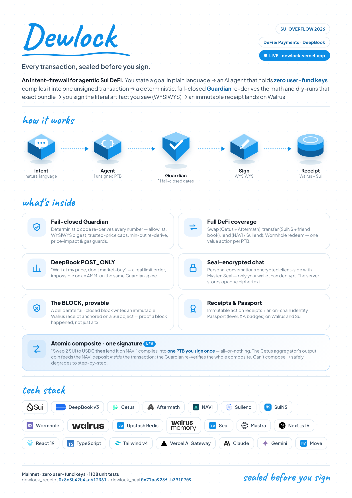

# Dewlock

<p align="center">
  
</p>

<p align="center">
  <b>An intent-firewall for agentic Sui DeFi.</b><br />
  State a goal in plain language → a single agent (holding <b>zero user-fund keys</b>) compiles it into
  one unsigned PTB → a deterministic, fail-closed <b>Guardian</b> re-derives the math and dry-runs that
  exact bundle → <b>you sign the literal artifact you saw</b> (WYSIWYS). Persistent memory + immutable
  receipts on Walrus.
</p>

<p align="center">
  <i>Every transaction, sealed before you sign.</i>
</p>

<p align="center">
  <sub><b>“Sealed” = Guardian-verified, not encrypted</b> — the Guardian re-derives the math and byte-locks each transaction to exactly what you reviewed (WYSIWYS). Sui <b>Seal</b> is a separate layer Dewlock uses only to encrypt your private conversations, never the transaction itself.</sub>
</p>

<p align="center">
  <a href="https://dewlock.vercel.app/"><b>Live App</b></a>
  ·
  <a href="docs/copilot-command-guide.md">Command Guide</a>
  ·
  <a href="docs/system-architecture.md">Architecture</a>
  ·
  <a href="docs/hand-off/03-security-model.md">Security Model</a>
  ·
  <a href="docs/guardian-sign-intent-flow.pdf">Sign-Intent Flow (PDF)</a>
</p>

<p align="center">
  
  
  
  
  
  
  
</p>

<p align="center">
  
</p>

## What It Is

Dewlock turns a natural-language intent ("swap 10 SUI to USDC", "send 1 SUI to alice.sui") into a single
**unsigned** Programmable Transaction Block. An AI copilot only *proposes*; a deterministic, code-authoritative
**Guardian** independently re-derives every value, dry-runs the exact bytes, and only then hands you a preview
to sign in your own wallet. The agent never holds user-fund keys and the LLM can never override a gate — code is
the gate, fail-closed on every dependency. What you sign is the literal artifact that was checked (WYSIWYS).

## Why It Stands Out

| Area | What is different |
| --- | --- |
| Fail-closed Guardian (the moat) | A deterministic 11-gate pipeline re-derives the math independently of the LLM; any failing gate blocks before a signature is requested. Missing price, bad cap config, dry-run/RPC failure, or unknown target all block rather than proceed. |
| WYSIWYS binding | `approvedDigest = sha256(txBytes)` binds the previewed/dry-run bytes to the signature — the wallet signs exactly what the Guardian checked. |
| Zero user-fund keys | The server builds + verifies unsigned PTBs only; signing is 100% in the user's wallet (`@mysten/dapp-kit`). |
| DeepBook POST_ONLY limit order | "Wait at my price, don't market-buy" — impossible on an AMM — on the same Guardian spine (POST_ONLY / self-match / expiry / BalanceManager-ceiling gates). |
| The BLOCK, provable | A deliberate fail-closed block (SuiNS lookalike + broken min-out) writes an immutable Walrus blob receipt anchored on a Sui object — proof a BLOCK happened, not just a tx. |
| Generative UI | Tool results render as structured cards (portfolio, swap/lend pickers, tx-preview, receipt, protocol registry) — not prose dumps. |

## Product Surface

| Feature | Status | Notes |
| --- | --- | --- |
| Copilot | Live | Natural-language chat; deterministic intent parser front-runs the LLM, generative-UI cards per action. |
| Swap / Sell | Live | Cetus Aggregator + Aftermath best-execution across activated venues; source-aware min-out re-derive. |
| Send | Live | SuiNS + saved-friend address book; recipient badge + @mention; homoglyph lookalike guard. |
| Lending: Deposit & Repay | Live | NAVI + Suilend (health-improving only); live health factor + APY. |
| Lending: Borrow & Withdraw | Live | NAVI only; post-tx health-factor gate; dedicated borrow-inflow cap. |
| Liquid staking: afSUI | Live | Aftermath via direct SDK; stake/unstake with live APY and instant redemption. |
| Liquid staking: haSUI | Beta | Haedal direct-PTB; built & tested in fixtures, pending mainnet verification. |
| Yield advisor | Live | Read-only ranked recommendations for idle balances; action buttons trigger normal Guardian flows. |
| Activity history | Live | Reverse-chronological feed of actions + BLOCKs; no fabricated P&L (cost-basis not stored). |
| Multi-step chaining (sequential) | Wired | End-to-end in-session; delta resolver + per-step signing; page refresh loses in-flight state. Needs mainnet verification. |
| Atomic composite (single-sign) | Gate only | Security gate implemented + tested; live builder is fail-closed (degrades to sequential). Not yet user-facing. |
| DeepBook limit order | Live | POST_ONLY resting order with self-match / expiry / BalanceManager-ceiling gates. |
| Cross-chain inflow | Live | Wormhole Sui-side redeem, built SDK-free, behind fail-closed bridge gates (recipient==self, VAA verify, fee model). |
| Portfolio | Live | Live balances + USD value; per-row swap/send quick actions. |
| Passport + receipts | Live | Level/XP/badges from immutable receipts; each action writes a Walrus blob + memwal log + optional Sui anchor. |

## Tech Stack

| Layer | Technology |
| --- | --- |
| Frontend | Next.js 16 (Turbopack), Tailwind v4, shadcn/ui, Mysten dApp Kit |
| Agent runtime | Mastra + AI SDK Gateway provider |
| Model | Gemini through Vercel AI Gateway |
| Guardian / builders | `@dewlock/agent` (gates) + `@dewlock/sui` (transfer/swap/limit-order/lend builders, dry-run, sign, SuiNS) |
| DeFi SDKs | `@cetusprotocol/aggregator-sdk`, `aftermath-ts-sdk`, `@mysten/deepbook-v3`, NAVI + Suilend |
| Memory | `@mysten-incubation/memwal` / Walrus Memory |
| Blob / receipts | `@mysten/walrus` — immutable action + BLOCK receipts |
| Chain | Sui Move package `dewlock_receipt` (on-chain receipt HEAD anchor) |
| Hosting | Vercel (serverless API + app) |

## Mainnet References

| Item | Value |
| --- | --- |
| Public app | <https://dewlock.vercel.app/> |
| Move package (`dewlock_receipt`) | `0x8c3b42b443da70be8bbc8cc6c0bfc0d91965f8b406b93d13c08f92949a612361` |
| UpgradeCap | `0xa1b226c385601033d9b14972cabd14f98081649aa9fcc84c210df46d335b0f2f` |
| Shared `Config` (v1) | `0xa8ece854…672a2c` |
| Server caps | conservative mainnet-small per-tx + per-day USD caps, server-enforced (values never exposed) |
| Tracks | DeFi & Payments · DeepBook |

## Repository Map

```text
sui-overflow-2026-hackathon/
├─ apps/
│  └─ web/          Next.js app — landing, /app copilot, /protocols registry, /api routes
├─ packages/
│  ├─ agent/        Guardian (fail-closed gates) + Mastra agent + tools
│  ├─ sui/          PTB builders (transfer/swap/limit-order/lend), dry-run, sign, SuiNS, protocol registry
│  └─ walrus/       memory (memwal) + blob + receipt helpers
├─ move/
│  └─ dewlock_receipt/   Sui Move package — on-chain receipt HEAD anchor
├─ docs/            architecture, security model, sign-intent flow (HTML/PDF), changelog
└─ scripts/         deploy, seeding, asset export helpers
```

---

<p align="center">
  Built for <b>Sui Overflow 2026</b> — DeFi &amp; Payments + DeepBook tracks.
</p>
